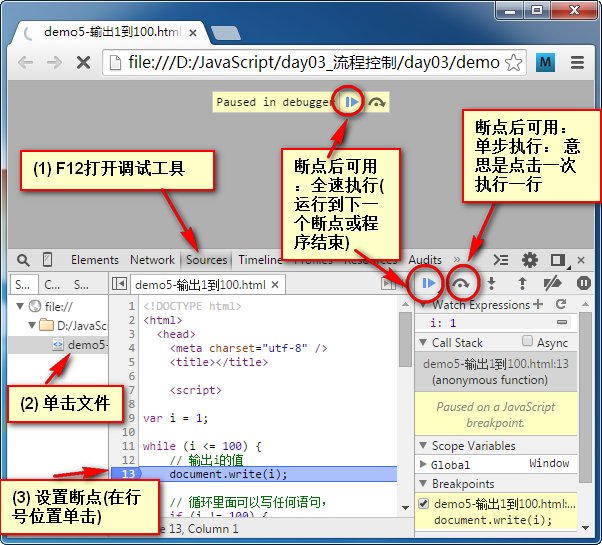

# 大纲 #
1. 循环语句 while
2. 循环语句 for 
3. 嵌套、调试

# 课程内容 #

## while ##

【案例】
输出以下图形：

```
**********
```

程序的三大结构
(1) 顺序结构： 从上往下执行
(2) 选择结构
(3) 循环结构： 重复执行某段代码


【练习】在页面上输出 1，2，3， 。。。 100


【案例】 打印100以内7的倍数

a % 7 == 0

思路：
7， 14， 21
下一个7的倍数 = 上一个7的倍数 + 7


【练习】 打印100以内的奇数


【案例】 打印100以内所有偶数的和


【练习】 求出 1+2+3 + .. + 100 的和


### break 和 continue ###

break 终止： switch, while

continue: 跳过当前循环中以下的所有代码


【练习】
小明本周上5天班，每天做同样的工作：
输出"hello world"，
但是星期二小明不想上班，请假一天；(continue)

---------

小明本周上5天班，每天做同样的工作：
输出"hello world"，
但是星期4的早上，小明收到消息中了500W，
他就直接提出了辞职，没有上班了。（break）


---------
debug: 找出bug的过程：

1. 暴力调试
2. 在线调试

Chrome 中的在线调试步骤
F12 打开在线调试工具，如下图所示：




断点: 程序暂停的位置，此时断点这行代码不执行
单步: 一次只执行一行代码
全速执行： 运行到下一个断点 或者 无断点时结束程序


---------
【案例】

```
**********
**********
**********
**********
```


## for循环 ##


固定次数： 起始值， 终止值， 增量 
            1      100    1   ==> 循环100次
            1      100    2   ==> 循环50次
            1      5      1   ==> 循环5次


语法：
for (var i = 起始值; i <= 终止值; i++ ) {
    循环的内容
}


【练习】 输出1，2， 。。。100 的数字 (使用for)


一个新入职，月工资为2000元的员工，每年涨工资5%，到退休时的月工资是多少？（年龄22-60）

打印100�C200之间所有能被3或者7整除的数  8K
计算100的阶乘  9K

### 打印图形 ###

【案例】

```
**********
```


---------
【案例】

```
**********
**********
**********
**********
```


```
*
**　
***
****
*****
```

【练习】打印10行的斜三角形
(demo11-打印图形.html)


 行号   星星数目
 1       1
 2       2
 3       3
 
 
 
 星星数目 == 行号 (规律是对的)
 5        5


```
    *
   **
  ***
 ****
*****
```
【练习】 打印10行的斜三角形


   行号  星星数  空格数
   1      1      4
   2      2      3
   3      3      2
   
   
   空格数 与 行号的关系 
   
   空格数 =  5-行号


```
*
***
*****
***
*
```


【案例】(难)输出100-200之间所有的素数  15K

素数, 也称为质数： 只能被1与自身整除的数字。

如果2~n-1 之间有一个数能整除n，那么n就不是质数


## do-while循环 ##

// 先执行循环体， 再判断条件
do {
	document.write(i + ", ");
	i++;
} while (i <= 5);


do-while 不管条件如何，总会执行第一次。

语法：

do {
    循环语句(if, while,for, do-while)
} while( 表达式 );


## 练习+扩展 ##
99乘法表


# switch #


# 作业 #
1. 打印出1-100里所有的偶数

2. 打印出1-100里所有的奇数

3. 求出1-1/2+1/3-1/4…..1/100的和

4. 输出20-80之间能被3整除的整数，每5个一行

5. 打印出1000-2000年中所有的闰年，并以每行四个数的形式输出

6. 输出九九乘法表

1*1 = 1
2*1 = 2 2*2 = 4
...


---------
以下内容选做：


求1+2!+3!+...+20!的值


求100-999之间的水仙花数。abc =a^3+b^3+c^3


求s=a+aa+aaa+aaaa+….+aa...a的值，其中a是一个数字。例如2+22+222+2222。 (注： a 和个数 从页面上输入)


