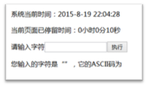

# 大纲 #

1. 日期对象
2. 定时
3. 日期处理

# 内容 #

## 日期对象 ##

1. 获取年月日 / 设置
2. 获取星期几
3. 获取时分秒


```
	// 得到 div 的元素
	var oDiv = document.getElementById("div1");

	// 定义一个空字符串的变量 str
	var str = "";

	// 日期对象，如果()为空，代表获取当前这一时刻的时间
	var obj = new Date();

	// 得到日期对象中的小时数
	str += obj.getHours();

	// 字符串后 加上 "："
	str += ":";
	str += obj.getMinutes();

	str += ":";
	// 获取日期对象中的秒数
	str += obj.getSeconds();

	oDiv.innerHTML = str;
```


### 案例 ###

将当前日期格式化输出为 “2015年08月24日 星期五”格式

---------


## 定时 ##


```
开启定时器, 定时的时间是毫秒
var timer = null;

timer = setInterval( function () {
	// 这里的代码会定时执行
}, 1000);


// 停止计时器
clearInterval(timer);

```

练习
1. 让圆圈移动 left: 300px
2. 让自动移动
3. 能停止


### 案例 ###


运动

```
	<style>
	  #div1 { width: 100px; height: 100px; background: red; border-radius: 50px; position: absolute; top: 50px; left: 100px;}
	</style>


<button id="btn"> 移动 </button>
	<div id="div1"> </div>

```


---------
轮播图


功能：

1. 定时更新
2. 鼠标移动到图后，停止滚动


## 日期处理 ##

1. Date.parse("2015-08-24")
    转换格式默认支持2015-08-24或2015/08/24
    如果需要支持其他格式，只能手动处理

2. new Date(time)
    创建一个日期对象，并指定时间  可以指定毫秒数
    或者修改time属性， var d = new Date();  d.setTime(56521211021);

3. getTime()/setTime()
    getTime获取某个日期自1970年以来的毫秒数
    setTime修改日期的毫秒数，对应的日期时间也会修改


### 案例 ###

[案例] 倒计时


## 经典问题 ##


2. 封装日期处理的函数库(重要！)
    判断某年份是否为闰年
    将日期格式化输出 “2015-08-24”
    获得某个月份的天数
    将字符串转换为日期（选做）
    判断两个日期相差的天数
    获得N天以后的日期
	
3. 页面上完成这几项功能




